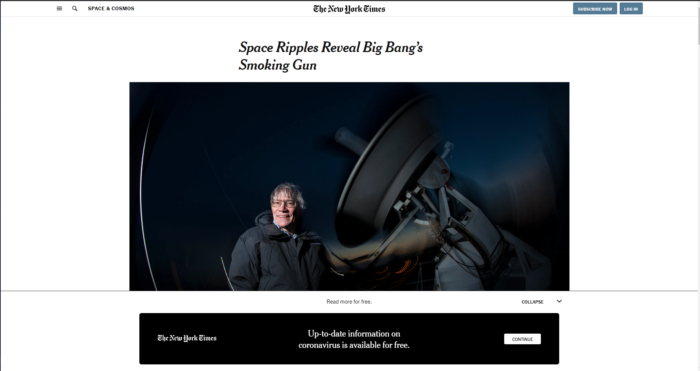
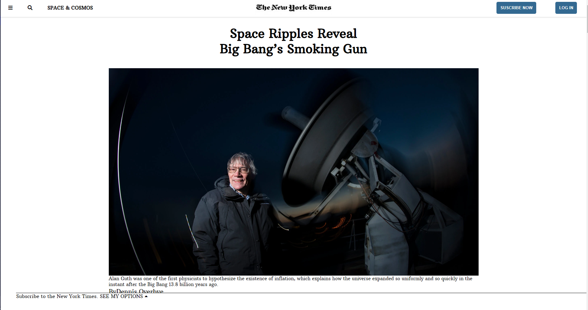

# Positioning-and-Floating-Elements - (New York Times Article Clone)

This project consisted of building an HTML document that would match the appearance of [this article from the New York Times](https://www.nytimes.com/2014/03/18/science/space/detection-of-waves-in-space-buttresses-landmark-theory-of-big-bang.html?_r=0)

You can find the original project specification [here](https://www.theodinproject.com/courses/html5-and-css3/lessons/positioning-and-floating-elements)

|Source Page|The cloned page screenshot|
|:---:|:---:|
|||

## Tools Used

- auto prefixer
- HTML
- CSS
- Flex & Grids
- FontAwsome v5.11.2
- MarkDown Syntax

## Work Done

- [x] Create Fixed Header Nav Bar
- [x] Create Article Div
- [x] Crete footer div
- [x] Use Semantic HTML
- [x] Use Flex or grid in the project
- [x] Pass CSS stylelint test
- [x] Check html with W3C validator
- [x] Validate Readme file with markdown lint

## How to Install and use

- clone the repository `git clone https://github.com/christianotieno/Positioning-and-Floating-Elements.git`
- open command prompt in `Positioning-and-Floating-Elements` folder
- run the application using open live server functionality.

LInk to live demo [here](https://rawcdn.githack.com/RoodzFernando/Positioning-and-Floating-Elements/faba9ea6ab4e675c99db2a661ee82be23f1c12eb/index.html)

## Authors social links

### 1. Roodz Fernando

- Github: [@RoodzFernando](https://github.com/RoodzFernando)
- Twitter: [@RoodzFernando](https://twitter.com/RoodzFernando)
- Linkedin: [Roodz Fernando](https://www.linkedin.com/in/roodz-fernando-fleurant/)

### 2. Christian Otieno

- Github: [@christianotieno](https://github.com/christianotieno)
- Twitter: [@iamchrisotieno](https://twitter.com/iamchrisotieno)
- Linkedin: [Christian Otieno](https://www.linkedin.com/in/christianotieno/)
